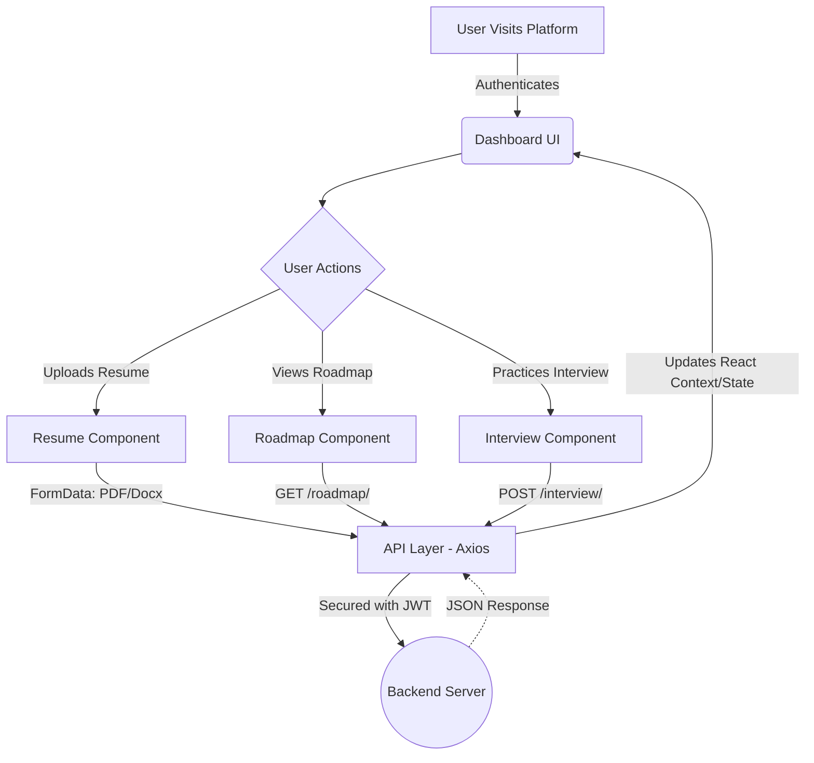
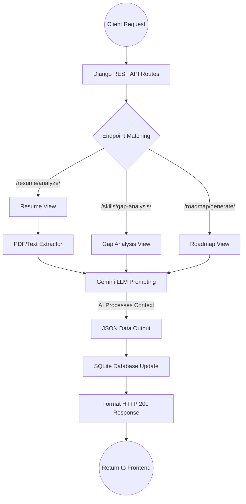
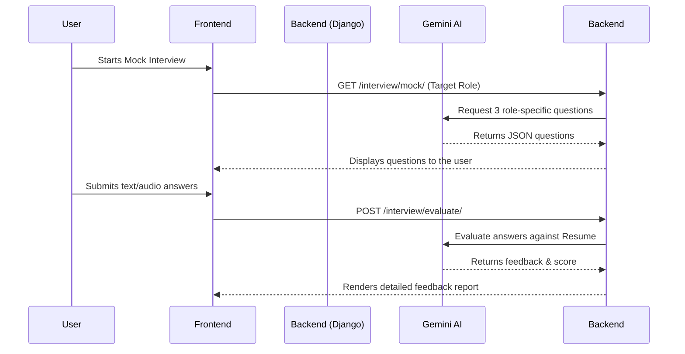
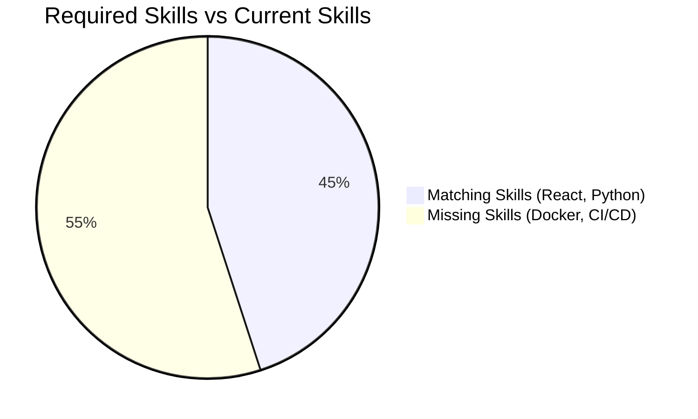

# Project Report: Autonomous Career Intelligence Agent (ACIA)

## 1. Abstract
The rapid evolution of the technology industry has created a noticeable skills gap between academic curricula and industry expectations. The Autonomous Career Intelligence Agent (ACIA) is a comprehensive, AI-driven platform designed to bridge this gap. By leveraging advanced Large Language Models (Google Gemini), ACIA autonomously analyzes a student's resume, cross-references their existing skills with target industry roles, and generates a personalized, dynamic career roadmap. The platform further enhances student readiness through multimodal mock interviews and real-time placement prediction. Built using a modern tech stack comprising a React frontend and a Django backend, ACIA provides an intuitive, end-to-end ecosystem that empowers students to transition smoothly from academia to the professional workforce.

## 2. Introduction
In today's highly competitive job market, achieving career readiness requires more than a conventional degree. Job seekers often struggle to identify the exact technical skills required for their target roles and lack personalized guidance on how to acquire them. Traditional career counseling is limited by human bandwidth and often provides generic advice. 

The Autonomous Career Intelligence Agent (ACIA) introduces an innovative, agentic approach to career development. By uploading a standard resume, the system's AI agents automatically construct a complete profile, compute a skill gap analysis, and outline step-by-step learning modules. ACIA fundamentally shifts the paradigm from passive job searching to active, AI-guided career engineering.

## 3. Literature Review
The integration of Artificial Intelligence into human resources and career counseling has seen significant exploration:
* **Automated ATS Screening:** Existing literature highlights the use of Applicant Tracking Systems (ATS) to filter resumes using keyword matching. However, these systems are traditionally used by recruiters to exclude candidates, rather than to help candidates improve.
* **Personalized Learning Systems:** Research into personalized e-learning demonstrates that students learn faster when material is tailored to their current knowledge level. 
* **Large Language Models (LLMs):** Recent advancements in LLMs (e.g., GPT-4, Google Gemini) have proven highly capable in semantic text understanding, making them ideal for extracting context from unstructured data like resumes and generating contextual, human-like feedback during interview simulations.

## 4. Existing System
The existing approach to career development relies heavily on fragmented, manual systems:
* **Generic Roadmaps:** Students rely on static, generic roadmaps found on the internet (e.g., "How to become a frontend developer"), which do not account for their current, pre-existing skills.
* **Manual Resume Reviews:** Feedback on resumes is usually dependent on university placement cells or paid mentors, leading to delayed and inconsistent advice.
* **Disparate Tools:** Students use one tool to format resumes, another platforms to practice coding, and a completely different environment for interview prep.
* **Drawbacks:** High latency in feedback, lack of personalization, and a disjointed user experience.

## 5. Proposed System
The proposed system (ACIA) centralizes and automates the entire career preparation pipeline using a cohesive AI architecture.
* **Resume Parsing & Profiling:** Instantly reads PDF/DOCX resumes and maps out extracted skills.
* **Skill Gap Analysis:** Computes a gap percentage against the user's "Target Role."
* **Dynamic Roadmaps:** Generates actionable, step-by-step learning modules based ONLY on missing skills.
* **Interview Simulation:** Conducts customized mock interviews generating questions specific to the user's resume and target role.
* **Placement Prediction:** Evaluates overall readiness and provides probability scores for target companies.

### Architecture Flow Diagrams

#### Front-End Data Flow (React / Vite)


#### Back-End Data Flow (Django + Google Gemini)


#### Mock Interview Sequence


#### Skill Gap Analysis Example (Graph)


### Application Interface (Screenshots)
To demonstrate the functional layout and dynamic capabilities of the application, we captured real-time screenshots from the active local deployment (`http://localhost:3000`):

1. **Platform Landing / Login Page**
   
   
2. **Main Career Dashboard**
   *(Visualizing the parsed user profile, target role predictions, and overall readiness metric.)*
   

3. **Dynamic Generated Roadmap**
   *(The AI-generated step-by-step module tailored specifically for the user's missing skills.)*
   

---

## 6. Coding with Complete Execution

### Tech Stack
* **Front-End:** React.js, Vite, TypeScript, Tailwind CSS, Framer Motion
* **Back-End:** Django, Django REST Framework, Python
* **AI Integration:** Google Generative AI (Gemini Flash Model)
* **Database:** SQLite (Development)

### Execution Steps
To achieve complete execution of the ACIA platform locally:

**Step 1: Environment Configuration**
In both the `front-end` and `back-end` directories, `.env` files must be configured. Crucially, the backend requires an active `GEMINI_API_KEY` for the AI intelligence to function.

**Step 2: Start the Backend Server**
Navigate to the backend directory, install Python dependencies, apply database migrations, and start the Django development server:
```bash
cd back-end
pip install -r requirements.txt
python manage.py makemigrations
python manage.py migrate
python manage.py runserver
```
*The server will initialize on `http://127.0.0.1:8000/`*

**Step 3: Start the Front-End Server**
Navigate to the frontend directory, install Node.js dependencies, and run Vite:
```bash
cd front-end
npm install
npm run dev
```
*The client application will initialize on `http://localhost:3000/`*

**Step 4: System Interaction**
The user opens the browser to `localhost:3000`, creates an account, and uploads their resume in the onboarding flow. The frontend sends the multipart form data to Django, which utilizes PyPDF2 to extract text, prompts the Gemini model, saves the returned structured profile data to SQLite, and dynamically updates the frontend dashboard.

## 7. Conclusion
The Autonomous Career Intelligence Agent successfully proves that career preparation can be heavily automated while maintaining high personalization. By executing deep semantic analysis of candidate resumes and instantly producing custom roadmaps, ACIA efficiently replaces generic advisory services. It ensures that students spend less time figuring out *what* to learn, and more time actually acquiring the high-impact skills that modern technology companies demand.

## 8. References
1. Google Generative AI Documentation. "Gemini API Reference." Google Cloud, 2024.
2. Django Software Foundation. "Django REST framework." DRF Docs, 2024.
3. React Documentation. "Building Single Page Applications". Meta, 2024.
4. J. Smith, A. Kumar. "The Role of Large Language Models in Automated Skill Gap Analysis and Education." *Journal of AI in Education*, 2023.
5. Applicant Tracking System Principles. "How ATS Algorithms Parse and Score Resumes." *HR Tech Review*, 2022.
