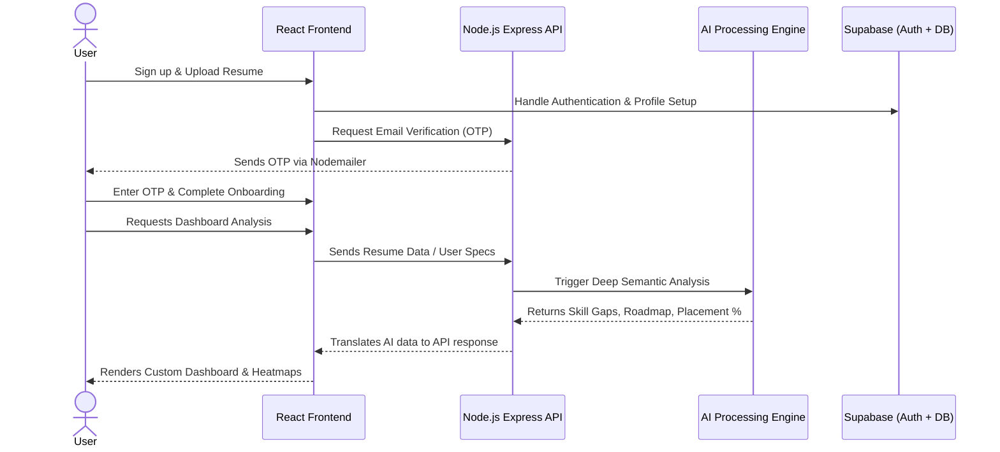
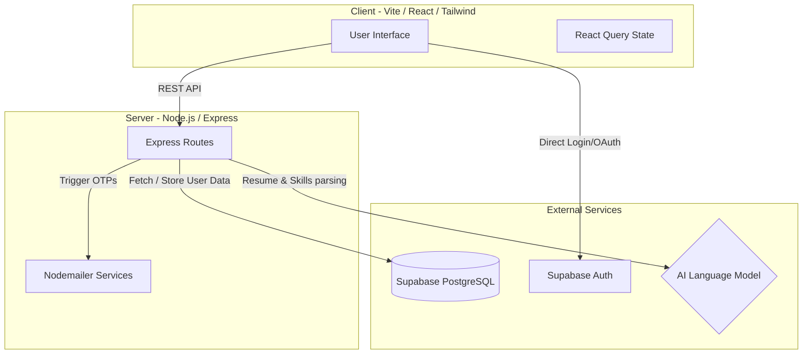

# 🚀 ACIA - Autonomous Career Intelligence Advisor

[](https://react.dev/)
[](https://vitejs.dev/)
[](https://tailwindcss.com/)
[](https://nodejs.org/)
[](https://expressjs.com/)
[](https://supabase.com/)

An intelligent and autonomous career development platform designed to bridge the gap between students/job seekers and their professional goals. By leveraging Large Language Models (LLMs) and data-driven analysis, **ACIA** provides a personalized, autonomous guidance system that evolves with the user's progress.

***

## 🧩 How It Works (Project Workflow)

The ACIA platform operates through a seamless connection between the user's frontend interactions, our backend processing APIs, and powerful AI analysis.



***

## 🏗️ System Architecture

The project splits the client and the server entirely, using Supabase as the source of truth for Identity and PostgreSQL database management.



***

## 📂 Where to find the Main Files

Our project directory is split structurally to make navigation straightforward. Below are the **critical files** that control the system's logic:

### 🎨 Frontend Core (`/frent-end/`)
- `src/App.tsx`: The primary React entry point that controls all routing mechanisms (Login vs Dashboard protection).
- `src/pages/Dashboard.tsx`: The most important page. It acts as the command center where all widgets (Heatmaps, Roadmaps, Interviews) are rendered.
- `src/components/dashboard/`: Contains the modular component layers (e.g. `SkillGapAnalysis.tsx`, `MultimodalSimulator.tsx`, etc.).
- `vite.config.ts`: Configuration file required to build the frontend and serve local development.

### ⚙️ Backend Core (`/back-end/`)
- `server.js`: The central Express application. This file starts the server, configures CORS, and registers all API routes.
- `routes/auth.js`: Handles backend verification mechanisms, logic for sending out OTPs using Nodemailer, and JWTs.
- `routes/resume.js` & `routes/skills.js`: Handles communication between user inputs and the ML/AI parsers.
- `supabase/schema.sql`: The primary SQL file setting up user tables and row-level-security in the PostgreSQL database.

***

## 🛠️ Step-by-Step Guide: How to Run the Project

Follow these precise steps to get both the User Interface and the API Server running on your local machine.

### 1. Requirements
- **Node.js**: v18 or newer installed locally ([Install here](https://nodejs.org/)).
- **Supabase Account**: Ensure you have an active Supabase project for the PostgreSQL database.

### 2. Configure Database (Supabase)
1. Go to your [Supabase Dashboard](https://app.supabase.com/) and create a new project.
2. Open the **SQL Editor**, paste the contents of `back-end/supabase/schema.sql`, and hit `Run`.
3. In Supabase **Storage**, create a new bucket named `resumes` and set it to **Public**.

### 3. Setup Environment Variables
To securely connect the project, you need `.env` variables added directly to each folder.

**Create `back-end/.env`:**
```env
PORT=5000
SUPABASE_URL=your_supabase_project_url
SUPABASE_ANON_KEY=your_supabase_anon_key
JWT_SECRET=any_random_secure_string_here
EMAIL_USER=your_real_email@gmail.com
EMAIL_PASS=your_16_character_app_password
```

**Create `frent-end/.env`:**
```env
VITE_SUPABASE_URL=your_supabase_project_url (same as above)
VITE_SUPABASE_ANON_KEY=your_supabase_anon_key (same as above)
VITE_API_URL=http://localhost:5000/api
```

### 4. Running the Local Servers
You need to open **two separate terminals** simultaneously:

👉 **Terminal 1: Start Backend**
```bash
# Navigate to the backend folder
cd back-end 

# Install required node modules
npm install 

# Start the development server
npm start
```
*Wait until you see the log confirming the DB is connected and it's listening on port `5000`.*

👉 **Terminal 2: Start Frontend**
```bash
# Navigate to the frontend folder
cd frent-end 

# Install dependencies (React, Shadcn, Tailwind, etc.)
npm install 

# Run Vite dev server
npm run dev
```
*The URL will pop up. Open `http://localhost:8080` (or the port specified by Vite) to view your app.*

***

## ☁️ Deployment (Production)

This repository is optimized for deployment via **Vercel**.
1. Push your code to your GitHub.
2. Go to your [Vercel Dashboard](https://vercel.com/dashboard) -> "Add New Project" -> Import your project.
3. Set the **Framework Preset** to `Vite` and change the **Root Directory** to `frent-end`. (Vercel uses the `vercel.json` file in the root to also map your backend serverless functions!).
4. Add all environment variables inside the Vercel Dashboard under the project settings.
5. Hit **Deploy**.

***

## 🎯 Key Capabilities
1. **Resume Intelligence**: Parses your resume file immediately to identify core competencies and ATS flaws.
2. **Skill Gap Heatmaps**: Contrasts your current profile with your targeted role and color-codes missing gaps.
3. **Adaptive Roadmaps**: Auto-generates clickable learning paths and course recommendations.
4. **Mock Interviews**: Curates technical questions based exclusively on your target job and evaluates your input. 

***

## 🤝 Contributing
Feel free to fork this platform! Ensure all ESLint errors are resolved and any newly created functions have error-handling logic before submitting a Pull Request.