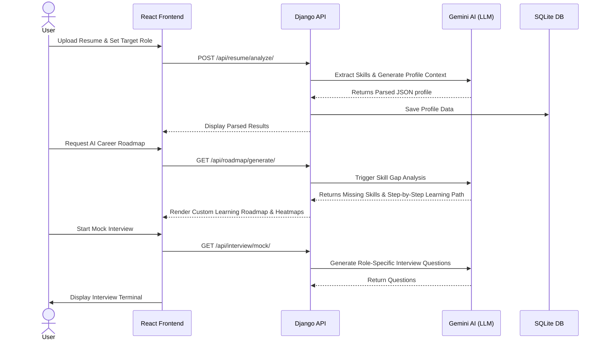
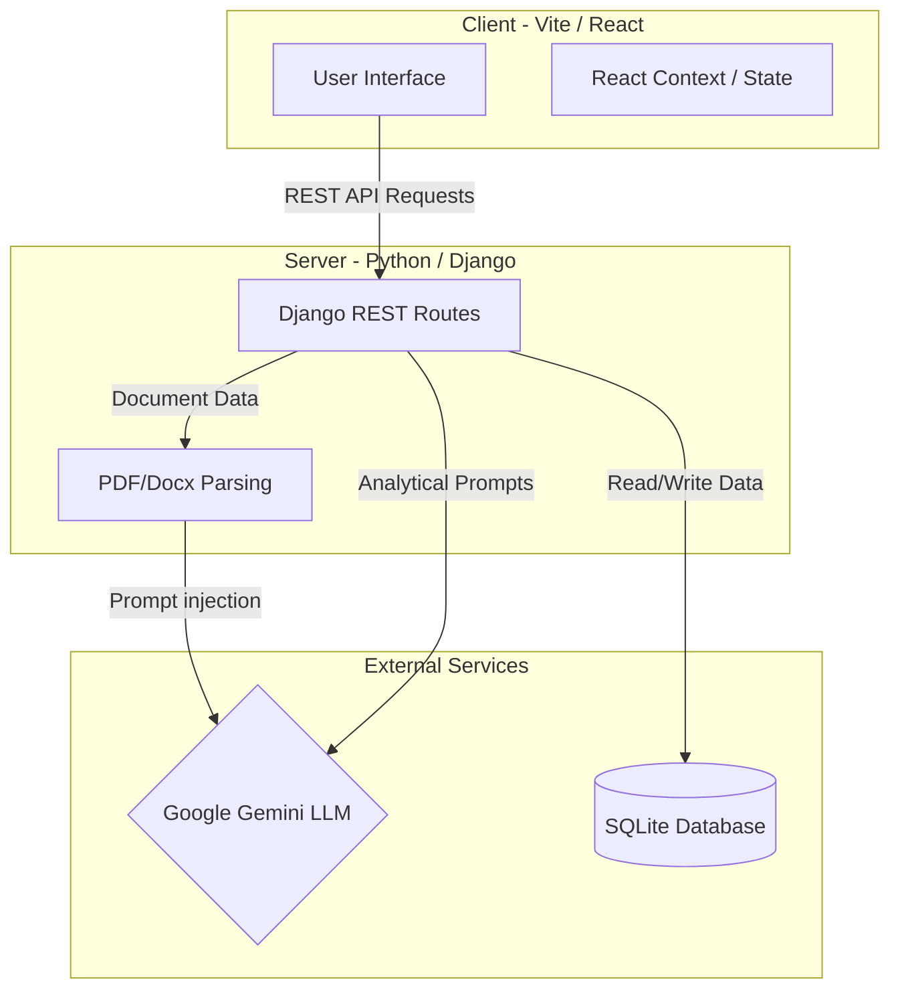

# 🚀 ACIA - Autonomous Career Intelligence Agent

[](https://react.dev/)
[](https://vitejs.dev/)
[](https://tailwindcss.com/)
[](https://www.djangoproject.com/)
[](https://www.python.org/)
[](https://deepmind.google/technologies/gemini/)

An intelligent and autonomous career development platform designed to bridge the gap between students/job seekers and their professional goals. By leveraging Large Language Models (Google Gemini) and data-driven analysis, **ACIA** provides a personalized, autonomous guidance system that evolves with the user's progress.

***

## 🧩 How It Works (Project Workflow)

The ACIA platform operates through a seamless connection between the user's frontend interactions, the Django backend, and the Gemini AI engine.



***

## 🏗️ System Architecture

The project cleanly splits the client layer (React) and the intelligence layer (Django + Gemini).



***

## 📂 Where to find the Main Files

### 🎨 Frontend Core (`/front-end/`)
- `src/App.tsx`: The primary React entry point that controls all routing mechanisms.
- `src/pages/Dashboard.tsx`: Controls the command center where all widgets and analysis results are rendered.
- `src/components/dashboard/`: Contains the modular UI panels (e.g., `SkillGapAnalysis.tsx`, `MultimodalSimulator.tsx`, `PlacementScore.tsx`).
- `vite.config.ts`: Configuration file required to build the frontend.

### ⚙️ Backend Core (`/back-end/`)
- `manage.py`: The entry point for running the Django server and triggering database migrations.
- `acia_backend/`: The main Django configuration folder containing settings and core URL routing.
- `api/`: The primary Django app dealing with all the backend logic.
- `api/views.py` / `api/urls.py`: Contains the REST endpoints handling resume uploads, roadmap generation, and mock interviews.
- `db.sqlite3`: The local development SQLite database storing user profiles and parsed resume data.

***

## 🛠️ Step-by-Step Guide: How to Run the Project

Follow these precise steps to get both the User Interface and the Django API Server running on your local machine.

### 1. Requirements
- **Python**: v3.9+ installed locally.
- **Node.js**: v18+ installed locally.
- **Gemini API Key**: You need an active API key from Google AI Studio.

### 2. Setup Environment Variables
To connect the project, configure your local `.env` files.

**Create `back-end/.env`:**
```env
GEMINI_API_KEY=your_google_gemini_api_key_here
SECRET_KEY=your_django_secret_key
DEBUG=True
```

**Create `front-end/.env`:**
```env
VITE_API_URL=http://127.0.0.1:8000/api
```

### 3. Running the Local Servers
You need to open **two separate terminal windows** simultaneously:

👉 **Terminal 1: Start Backend (Django)**
```bash
# Navigate to the backend folder
cd back-end 

# Install required Python modules
pip install -r requirements.txt

# Run Database Migrations
python manage.py makemigrations
python manage.py migrate

# Start the Django development server
python manage.py runserver
```
*Wait until you see the log confirming it's listening on `http://127.0.0.1:8000/`.*

👉 **Terminal 2: Start Frontend (React/Vite)**
```bash
# Navigate to the frontend folder
cd front-end 

# Install dependencies (React, Shadcn, Tailwind, etc.)
npm install 

# Run Vite dev server
npm run dev
```
*The terminal will provide a localhost URL (usually `http://localhost:3000` or `http://localhost:5173`). Open it to view the platform!*

***

## 🎯 Key Capabilities
1. **Resume Intelligence**: Parses your resume identifying core competencies using Google Gemini.
2. **Skill Gap Heatmaps**: Contrasts your current profile with your targeted role and color-codes missing gaps.
3. **Adaptive Roadmaps**: Auto-generates achievable learning paths based exclusively on the missing skills.
4. **Mock Interviews**: Curates technical questions based on your specific profile/role, evaluating your input dynamically via LLM.

***

## 🤝 Contributing
Feel free to fork this platform! Ensure all React components pass linting and the Django backend migrations are successfully committed before opening a Pull Request.